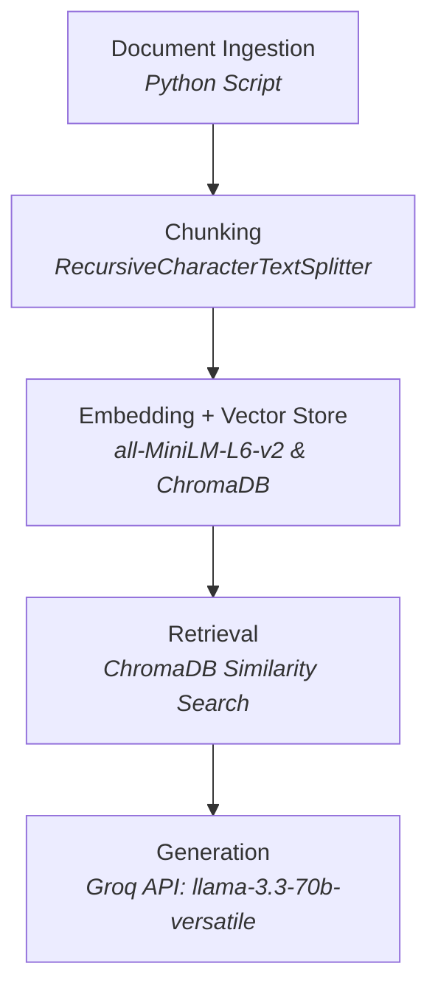

# Project 1 Planning: The Unofficial Guide

> Write this document before you write any pipeline code.
>
> Your spec and architecture diagram are what you'll use to direct AI tools (Claude, Copilot, etc.) to generate your implementation — the more specific they are, the more useful the generated code will be.
>
> Update the **Retrieval Approach** and **Chunking Strategy** sections if you change your approach during implementation, and update this file before starting any stretch features.

---

## Domain

**The Unofficial Guide to Quantum Computing Careers and Learning.**

While there are thousands of official textbooks and vendor docs (IBM, Google) explaining the physics of quantum mechanics, it is incredibly difficult to find honest, grounded information about the *reality* of working in the field. This domain captures the "unofficial" knowledge:

- Salary bands
- How much math you actually need for a SWE role
- Honest reviews of certifications
- The struggles of dealing with noisy quantum hardware vs. the startup hype

This is valuable for traditional computer scientists looking to pivot into the industry without getting a PhD.

---

## Documents

| #  | Source                  | Description                                          | URL or location                                                             |
|----|-------------------------|------------------------------------------------------|-----------------------------------------------------------------------------|
| 1  | r/QuantumComputing      | Thread on getting a QC job without a PhD             | `reddit.com/r/QuantumComputing/` → `documents/01_reddit_phd_job.md`         |
| 2  | Hacker News             | Thread about the realities of Quantum Startups      | `news.ycombinator.com/` → `documents/02_hn_startup_reality.md`              |
| 3  | Personal Blog           | Honest review of the IBM Qiskit Developer Cert      | `medium.com/tag/qiskit` → `documents/03_qiskit_cert_review.md`              |
| 4  | r/learnmachinelearning  | Discussion on the usefulness of QML                 | `reddit.com/r/learnmachinelearning/` → `documents/04_qml_usefulness.md`     |
| 5  | Physics StackExchange   | Intuitive explanation of Shor's Algorithm for SWEs  | `physics.stackexchange.com/` → `documents/05_shors_algorithm_intuitive.md`  |
| 6  | Awesome List Gist       | Opinionated commentary on QC frameworks/books       | `github.com/topics/quantum-computing` → `documents/06_awesome_quantum_rants.md` |
| 7  | YouTube Transcript      | A day in the life of a Quantum Software Engineer    | `youtube.com/` → `documents/07_day_in_life_qse.md`                          |
| 8  | r/OMSCS                 | Reviews on GT's CS 8803 (Intro to QC) course        | `reddit.com/r/OMSCS/` → `documents/08_omscs_quantum_course.md`              |
| 9  | Blind (Teamblind)       | Salary and interview culture at Rigetti/IonQ/IBM    | `teamblind.com/company/Rigetti` → `documents/09_teamblind_quantum_tc.md`    |
| 10 | Discord Archive         | Unofficial FAQ for a Quantum Hackathon              | Local Discord Export → `documents/10_hackathon_faq.md`                      |

---

## Chunking Strategy

<!-- How will you split documents into chunks?
     State your chunk size (in tokens or characters), overlap size, and explain why those
     numbers fit the structure of your documents.
     A review-heavy corpus warrants different chunking than a long FAQ. -->

- **Chunk size:** ~512 characters
- **Overlap:** ~64 characters

**Reasoning:** The source documents are mostly short, conversational forum posts and lists. A fixed-size character chunking strategy is a robust starting point. A chunk size of ~512 characters is large enough to contain a complete thought (like a single Reddit comment or a list item with its description) but small enough that the semantic meaning isn't diluted by unrelated topics within the same chunk. The 64-character overlap helps preserve context for ideas that might be split across a chunk boundary, reducing the chance of losing key information.

---

## Retrieval Approach

<!-- Which embedding model are you using (e.g., all-MiniLM-L6-v2 via sentence-transformers)?
     How many chunks will you retrieve per query (top-k)?
     If you were deploying this for real users and cost wasn't a constraint, what tradeoffs
     would you weigh in choosing a different embedding model — context length, multilingual
     support, accuracy on domain-specific text, latency? -->

- **Embedding model:** `all-MiniLM-L6-v2` via `sentence-transformers`
- **Top-k:** 4

**Production tradeoff reflection:** For a real production system where cost is not a constraint, I would evaluate a larger, more powerful API-based model like OpenAI's `text-embedding-3-large`. The key tradeoffs would be **accuracy vs. latency and cost**. The larger model would likely provide more nuanced and accurate embeddings for domain-specific jargon (like "NISQ" or "T1 coherence times"), leading to better retrieval. However, this comes at the cost of higher per-query pricing and increased network latency compared to the fast, free, and local `all-MiniLM-L6-v2`.

---

## Evaluation Plan

<!-- List your 5 test questions with their expected correct answers.
     Questions should be specific enough that you can judge whether the system's response
     is right or wrong. "What are good dining halls?" is too vague.
     "What do students say about wait times at [dining hall name] during lunch?" is testable. -->

| # | Question | Expected answer |
|---|----------|-----------------|
| 1 | According to Blind reviews, what is the expected base salary range for a mid-level SWE at IBM Quantum? | Expect around $160k-$180k base for a mid-level SWE, plus a 10% bonus. |
| 2 | According to the review of the IBM Qiskit Developer Certification, how many questions are on the exam and what score is needed to pass? | It is a 60-question multiple-choice test and you need roughly a 68% to pass. |
| 3 | Which quantum computing book is referred to as the "holy bible" of the field, and why is it not recommended for beginners? | "Quantum Computation and Quantum Information" (Nielsen & Chuang). It is not recommended for beginners because it is a dense physics textbook. |
| 4 | If I don't have a PhD, what specific roles should I target at a quantum company according to QubitWrangler? | You should target "Quantum Software Engineer" or "Control Systems Engineer" roles, not "Quantum Research Scientist". |
| 5 | What specific math concepts should I review before taking the OMSCS CS 8803 course, and what is the typical weekly workload? | You should review linear algebra, specifically Hilbert spaces, tensor products, and unitary matrices. The typical workload is about 15-20 hours a week. |

---

## Anticipated Challenges

<!-- What could go wrong? Name at least two specific risks with reasoning.
     Consider: noisy or inconsistent documents, missing source attribution, off-topic
     retrieval, chunks that split key information across boundaries. -->

1. **Splitting Key Information:** The biggest risk is that the fixed-size chunking will split a single, coherent thought across two chunks. For example, a question in a FAQ might be the last line of one chunk, and its answer might be the first line of the next. Retrieval might only pull the chunk with the question, leaving the LLM without the necessary context to form an answer.
2. **Distinguishing Conflicting Opinions:** The documents contain many subjective and conflicting opinions (e.g., "Qiskit is bloated" vs. "Qiskit is the industry standard"). The embedding model is trained on semantic similarity, so a query for "Why is Qiskit bad?" might retrieve chunks that say Qiskit is good, simply because they are on the same topic. The system might struggle to retrieve only the chunks that match the user's specific sentiment or viewpoint.

---

## Architecture

---

## AI Tool Plan

<!-- For each part of the pipeline below, describe:
     - Which AI tool you plan to use (Claude, Copilot, ChatGPT, etc.)
     - What you'll give it as input (which sections of this planning.md, which requirements)
     - What you expect it to produce
     - How you'll verify the output matches your spec

     "I'll use AI to help me code" is not a plan.
     "I'll give Claude my Chunking Strategy section and ask it to implement chunk_text()
     with my specified chunk size and overlap" is a plan. -->

**Milestone 3 — Ingestion and chunking:**
I will provide an AI assistant with my `Chunking Strategy` section and my list of `Documents`. I will ask it to generate a Python script that loads all `.md` files from the `documents/` directory and uses a text splitter (like LangChain's `RecursiveCharacterTextSplitter`) to implement the specified ~512 character chunk size and ~64 character overlap. I will verify the output by printing 5–10 chunks and manually checking their length and that they don't contain markdown artifacts.

**Milestone 4 — Embedding and retrieval:**
I will give the AI my `Retrieval Approach` section and the chunking script from the previous step. I will ask it to write two functions:

1. A function that takes the list of text chunks, embeds them using `sentence-transformers` with `all-MiniLM-L6-v2`, and stores them in a local ChromaDB collection with source metadata.
2. A `retrieve(query)` function that queries ChromaDB for the `top-k=4` most similar chunks.

I will verify this by running my evaluation questions through the `retrieve` function and checking if the returned chunks are relevant.

**Milestone 5 — Generation and interface:**
I will provide the AI with the `retrieve` function and my grounding requirements (answer only from context, cite sources, say "I don't know"). I will ask it to create a main function that takes a user query, calls the retrieval function, formats the retrieved chunks into a system prompt for the Groq API (`llama-3.3-70b-versatile`), and returns a grounded answer. I will then ask it to wrap this main function in a simple Gradio interface, using the skeleton from the project guide as a template. I will verify the output by asking an out-of-scope question and ensuring the system responds that it doesn't have enough information.
